# WWIIHexV0 Mermaid 核心流程图

> 本图参照 `md/flow/flow.md`。每个图块都用“中文解释 + 关键代码名”标注：先看中文理解逻辑，再用代码名回到源码定位。

## 0. 读图总纲

项目当前最重要的逻辑是：

```text
地图编辑器/JSON 数据
  -> 游戏启动加载为 GameState
  -> hex 是真实战术权威
  -> region / theater / front / deploy 都是从 hex 和单位位置派生出来的战略层
  -> economy 是 faction 级经济总账，收入仍从真实控制的 hex/region 聚合
  -> diplomacy / mandate 是国家级投影和展示来源，不替代战术敌我或控制权；唐宋胜利评价会读取天命
  -> turn order / power profile 是 v5.1 多势力回合桥
  -> v5.6f 起 UI/AI/WarCommandExecutor 的战术候选也读取 WarRelationRules.canTarget
  -> v5.6g 起唐宋胜利评价优先读取场景 JSON victoryConditions
  -> v5.6h 起 HUD/战报只读显示 VictoryState.reason
  -> v5.6i 起 HUD/战报只读显示 VictoryRules.objectiveProgress
  -> v5.7a 起 HUD 只读显示 RootGameView.nextActionHint
  -> v5.7b 起 HUD 只读显示统一目标已据/待取锚点
  -> v5.7c 起 HUD 目标锚点可只读聚焦目标州府
  -> v5.7d 起地图只读绘制目标州府 spotlight
  -> v5.7e 起战报面板只读汇总每回合战报摘要
  -> v5.7f 起 HUD 只读显示指挥身份/观战模式并确认重开剧本
  -> v5.7g 起下一步提示只读读取移动/攻击高亮数量
  -> v5.7h 起唐宋主界面可切换 legacy 亲征阵营与观战模式
  -> v5.7i 起战报面板只读显示胜负后评分估算与短档位
  -> v5.7j 起下一步提示对当前 UI 候选做有限合法性预校验
  -> v5.7k 起军队/州府检查面板补齐唐宋读法
  -> v5.7l 起将领指挥/档案面板补齐唐宋读法
  -> v5.7m 起常驻军队 tooltip 补齐唐宋读法
  -> v5.8a 起 AI 面板默认主路径残留硬化
  -> v5.8b 起 AI 面板玩家态/开发态分层
  -> v5.8c 起外交面板默认主路径读法硬化
  -> v5.8d 起战报日志默认主路径读法硬化
  -> v5.8e 起 MapEditor 默认资源和可见读法硬化
  -> v5.8g 起主游戏默认启动不再静默回退阿登
  -> v5.8h 起唐宋将领注册表默认读取 tangsong_characters
  -> v5.8i 起命令反馈与战报元数据隐藏 raw validation / record id
  -> v5.8j 起军队/州府检查面板隐藏 raw id 与英文目标状态
  -> v5.8k 起命令面板和战报 raw 英文兜底不直出玩家
  -> v5.8l 起将领计划摘要和固定英文 UI 继续硬化
  -> v5.8m 起外交面板 Latin 名称与 ASCII 连接符继续硬化
  -> v5.8n 起 AI 面板原始文本与 Latin 兜底继续硬化
  -> v5.8o 起将领/州府面板固定英文与 ASCII UI 继续硬化
  -> v5.8p 起兵力、粮道与地图数值标记 ASCII UI 继续硬化
  -> v5.8q 起 AppContainer 常见交互反馈写入端继续中文化
  -> v5.8r 起胜利、粮道与军议摘要显示继续硬化
  -> v5.8s 起 MapEditor raw 文件名、坐标、JSON 技术词与导出错误继续硬化
  -> v5.8t 起 accessibility label/value/hint 与 MapEditor 画布可读文案继续硬化
  -> v5.8u 起军令、府库、亲征观战和目标锚点控件状态提示继续硬化
  -> v5.8v 起 MapEditor raw 错误、示例输入和编辑框读屏上下文继续硬化
  -> v5.8w 起主棋盘 VoiceOver 自定义动作继续硬化，读屏动作仍复用 handleBoardTap 与规则链路
  -> v5.8x 起地图图层、紧凑面板、将领军令按钮和面板 fallback 继续硬化
  -> v5.8y 起常驻 tooltip 与军队/州府检查面板读法继续硬化
  -> v5.8z 起将领档案关闭、指标、技能、辖下军队和缺名 fallback 继续硬化
  -> v5.8aa 起 MapEditor 画布 value、底图控件和快捷说明继续硬化
  -> v5.8ab 起 MapEditor 画布粮源与军队符号继续硬化
  -> v5.8ac 起军议与方面军令反馈继续硬化
  -> v5.8ad 起府库军备队列剩余回合、收入指标和读屏语义继续硬化
  -> v5.8ae 起 HUD 库存指标、军备队列数量和指标行读屏继续硬化
  -> v5.8af 起将领军令面板指标、所属军队和已拟军令读屏继续硬化
  -> v5.8ag 起战报列表行分类、元数据和正文整行读屏继续硬化
  -> v5.8ah 起战报摘要卡片标题、回合、汇总和重点条目读屏继续硬化
  -> v0.5 元帅层是战略意图层，不替代战术权威
  -> 玩家和 AI 都必须把命令交给 RuleEngine
  -> 命令执行后再同步刷新战略层和 UI
```

图里颜色含义：

- 红色：权威状态，不能被下游反向覆盖。
- 绿色：派生状态，可以重建，但来源必须清楚。
- 蓝色：初始快照/基准状态，不是运行时推进状态。
- 紫色：命令管线，玩家、AI、未来聊天命令都要走这里。

## 1. 总主线：从地图数据到游戏行动

这张图看全局。左上是地图数据怎么进入游戏；中间是 hex、region、theater、front、deploy 的分层关系；右侧是玩家/AI 命令如何统一进入规则系统；底部是 UI 和日志怎么读取结果。

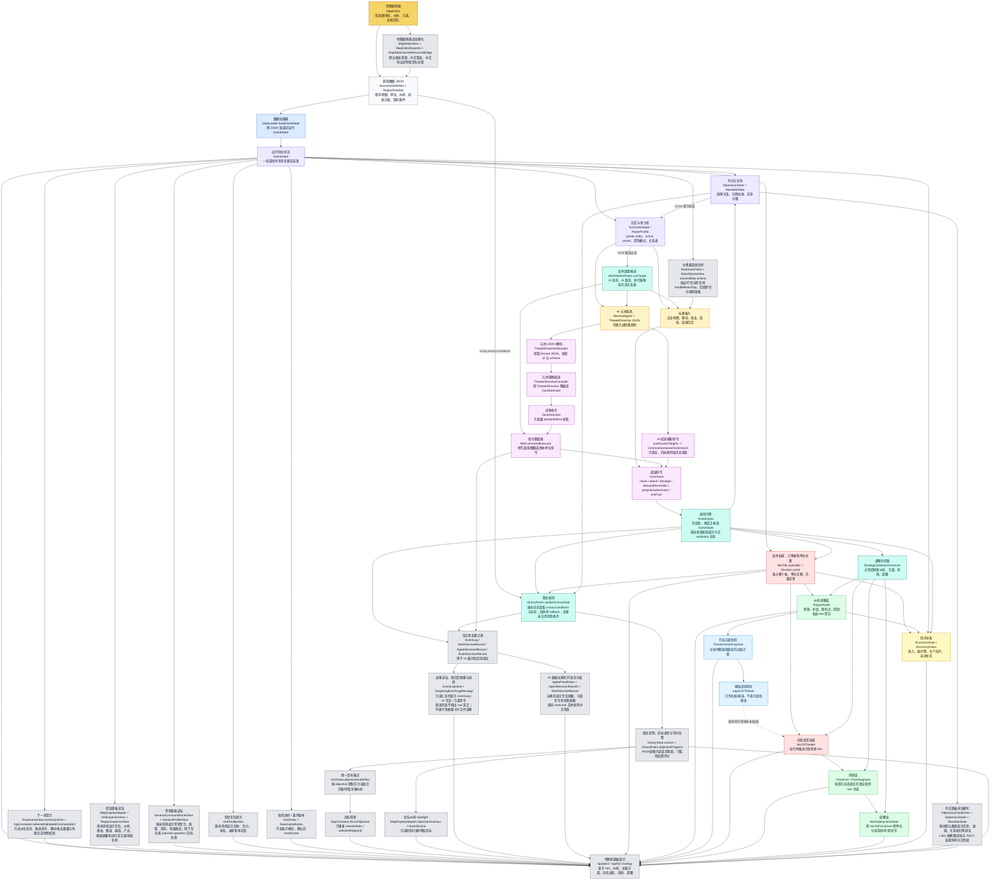

## 2. 占领与动态推进：一个单位移动后发生什么

这张图只看最容易出 bug 的链路：单位移动到敌控空格后，游戏如何占领这个 hex，并且只推进这个 hex 的动态战区和部署归属。

核心原则：占一个 hex，只改这个 hex 的 `hexToTheater` / `hexToFrontZone`；不能把整个 region 的 `regionToTheater` 改掉。

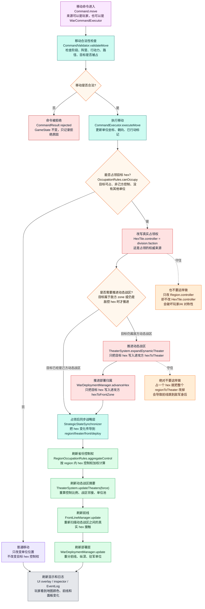

## 3. v0.8 经济、生产与补员链路

这张图看 v0.8 初级经济。经济总账是 faction 级资源池，但收入和部署资格仍回到真实 hex 控制和 region 聚合；生产命令仍走 `RuleEngine`，UI 不直接改 `GameState`。

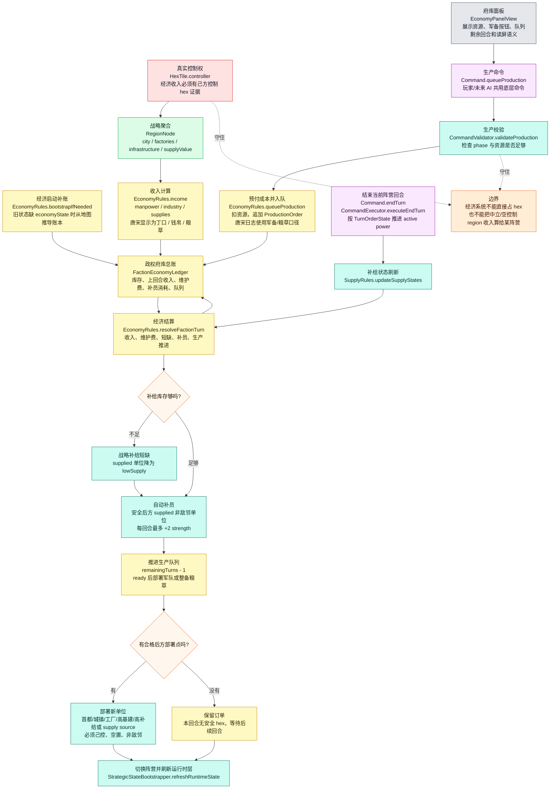

## 3.5 v5.3 唐宋古代兵种战斗修正

这张图看 v5.3 的战斗数值切片。底层 `ComponentType` 仍保留 legacy case；唐宋角色由单位 id、生产 kind id 和现有组件权重推导。修正只在 `state.isTangSongScenario` 为 true 时启用，阿登 legacy 路径仍走原装甲/火炮规则。

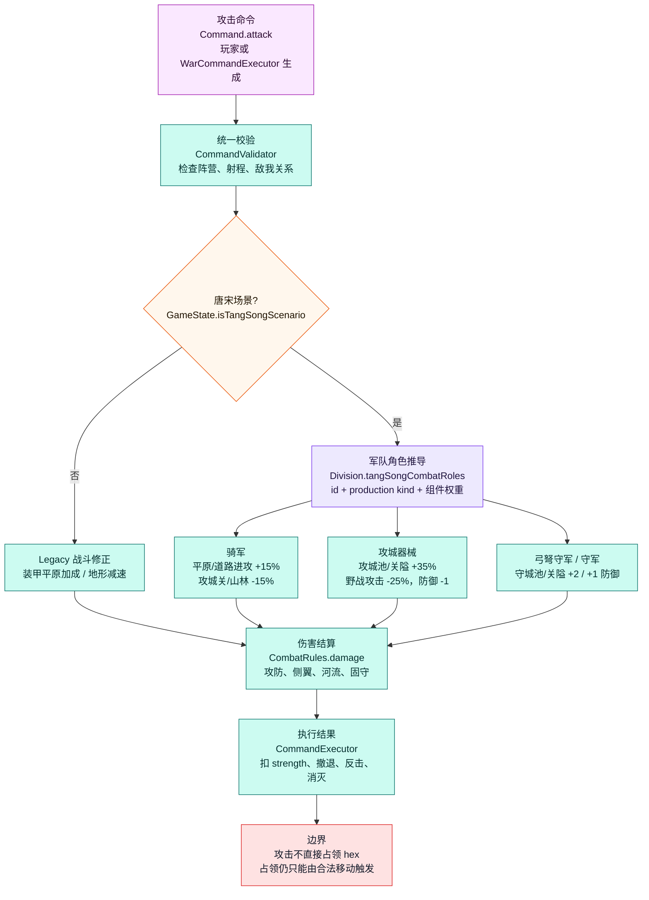

## 3.6 v5.3 唐宋粮道供给首轮

这张图看 v5.3/v5.5 的粮道供给与地图读法切片。它不新增补给状态，也不实现完整漕运；只是让唐宋场景的高补给州府/粮仓和道路、山林、跨河成本影响既有 `supplied / lowSupply / encircled` 判定，并在单位面板和地图只读 overlay 显示粮道通断、路径成本和最近粮源。

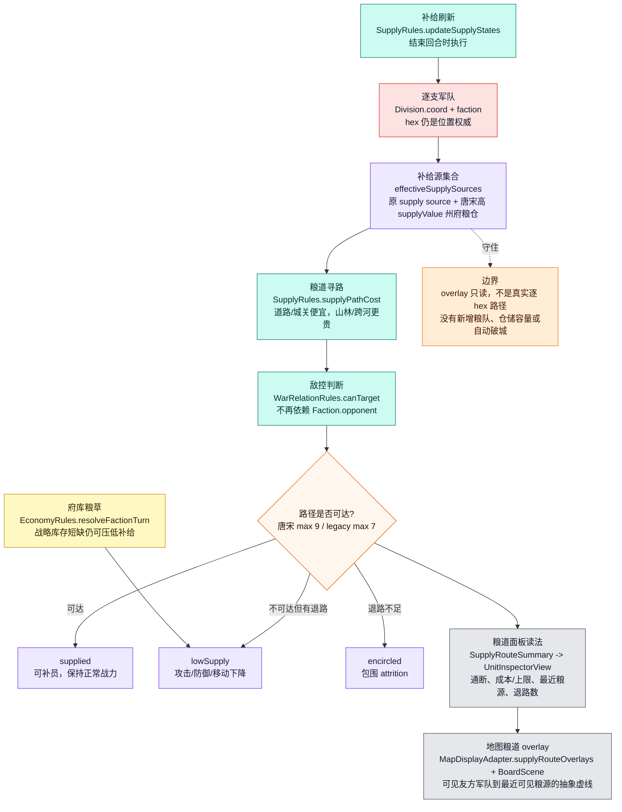

## 3.7 v5.3 唐宋围城城防、修城、解围与招降首轮

这张图看 v5.3 的围城最小闭环。围城、修城、解围和招降都是底层 `Command`，仍经 `RuleEngine` 校验执行；围城记录压力与城防，城防归零后才在回合结算压低守军补给，解围只削减 pressure 或移除 SiegeRecord。招降是显式命令，只有 pressure 达标、城防归零且守军不再 supplied 后才交割目标州府可占 hex，并调用战略同步器刷新派生层。地图围城 overlay 只从 `SiegeState` 派生显示，不参与规则写入；AI 围城/招降首轮让 `ZoneDirective.attack` 经 `WarCommandExecutor` 生成底层 `Command.demandSurrender` 或 `Command.besiege`。

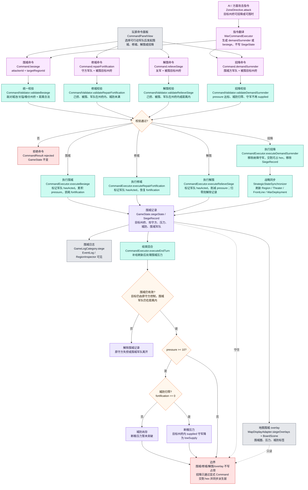

## 4. AI / 元帅决策链：AI 怎么下命令

这张图看 v0.5 分支默认 AI 主路径。AI 不直接控制单位，也不直接改地图；元帅先读取降维战场摘要，模拟 LLM 输出 `TheaterDirectiveEnvelope` JSON，经 decoder 校验和 compiler 降级后，形成战区级 `DirectiveEnvelope`。`WarCommandExecutor` 再把这些战术翻译成底层 `Command`，最后交给 `RuleEngine`。v5.6c 另有一条 AI 招抚辅助桥：`pacificationTargets` 不进入 `WarCommandExecutor`，而是由 `TurnManager` 在战争指令后、`.endTurn` 前尝试生成 `Command.proposeSubmission`，仍由 `RuleEngine` 决定成败。

当前 v0.5 的默认 AI 战争主线是 `MarshalAgent -> TheaterDirective JSON -> TheaterDirectiveDecoder -> TheaterDirectiveCompiler -> ZoneDirective -> WarCommandExecutor -> RuleEngine`。v5.6c 的 AI 招抚辅助主线是 `TheaterDirectiveEnvelope.pacificationTargets -> TurnManager.executePacificationTargets -> Command.proposeSubmission -> RuleEngine`。旧 v0.37 `TheaterCommanderPool -> ZoneCommanderAgent` 作为 fallback 和显式 `.zoneDirective` 路径保留。统治者层只作为后续上游预留，当前不在主链路调用。旧 Agent D 管线仍保留，但默认不走。

```mermaid
flowchart TD
    START["触发 AI 行动<br/>AppContainer.advanceOrRunAI / runAIIfNeeded<br/>玩家点下一回合，或命令后轮到 AI"]:::input
    CHECK{"当前势力该由 AI 控制吗?<br/>TurnOrderState / PowerProfile 判断控制权"}:::decision
    STOP["不运行 AI<br/>等待玩家操作或阶段切换"]:::stop
    REFRESH["行动前刷新运行时战略层<br/>StrategicStateBootstrapper.refreshRuntimeState<br/>避免 AI 读到旧前线/旧部署"]:::rules
    TM["AI 回合编排器<br/>TurnManager.runAITurn<br/>默认 pipelineMode = marshalDirective"]:::rules
    SUM["战场摘要<br/>MarshalBattlefieldSummarizer<br/>只给元帅 front/deploy/目标/补给/场景摘要，不给全量 hex"]:::ai
    LLM["模拟 LLM 客户端<br/>SimulatedMarshalLLMClient<br/>输出 fenced JSON；唐宋场景填军议文案与 mandate/court/pacification/supply 解释字段，不接真实网络或模型"]:::ai
    DEC["元帅 JSON 解码器<br/>TheaterDirectiveDecoder<br/>提取 JSON、解码、校验 schema/zone/region/tactic"]:::command
    COMP["元帅意图编译器<br/>TheaterDirectiveCompiler<br/>TheaterDirective -> ZoneDirective<br/>传递 focus/convergence/coordinated 参数"]:::command
    ENV["指令信封<br/>DirectiveEnvelope<br/>收集编译后的 ZoneDirective"]:::command
    TACTIC["高级战术路由<br/>TacticName<br/>raw case 保持 Codable；唐宋显示为进军、骑军突进、合围、弓弩压制等"]:::command
    WCE["指令执行器<br/>WarCommandExecutor.execute<br/>按战术 profile 选择单位、目标和 fallback"]:::command
    BOTTOM["具体单位命令<br/>Command<br/>attack / move / hold / allowRetreat / besiege / demandSurrender"]:::command
    PAC["AI 招抚辅助桥<br/>TurnManager.executePacificationTargets<br/>pacificationTargets -> Command.proposeSubmission<br/>不经过 WarCommandExecutor"]:::command
    RE["统一规则校验执行<br/>RuleEngine<br/>AI 和玩家共用同一套规则"]:::rules
    RECORD["指令复盘记录<br/>AgentDecisionRecord + WarDirectiveRecord<br/>保存诏令朝议摘要、tactic、target、结果、拒绝原因"]:::ui
    PANEL["AI 面板<br/>AgentPanelView<br/>显示军议、诏令/朝议、招抚/转运和方面军令"]:::ui
    END["AI 自动结束回合<br/>RuleEngine.execute(.endTurn)<br/>切换 activeFaction / phase"]:::rules

    START --> CHECK
    CHECK -->|否| STOP
    CHECK -->|是| REFRESH --> TM --> SUM --> LLM --> DEC --> COMP --> ENV
    ENV --> TACTIC --> WCE --> BOTTOM --> RE --> RECORD
    ENV --> PAC --> RE
    RE --> END
    RECORD --> PANEL

    FALLBACK["Fallback 将军池<br/>TheaterCommanderPool + ZoneCommanderAgent<br/>元帅 JSON 无效或某 zone 无指令时使用"]:::ai
    DEC -.解码失败.-> FALLBACK --> ENV
    COMP -.zone 缺指令.-> FALLBACK

    LEGACY["旧 Agent D 管线<br/>AgentContext -> DecisionProvider -> AgentCommandMapper<br/>只在 legacyAgentOrder 显式分支或测试中使用"]:::legacy
    TM -.默认不走.-> LEGACY

    MANUAL["手写战区指令<br/>手工 ZoneDirective<br/>玩家聊天命令也可以直接指定 tactic/focus/convergence"]:::input
    MANUAL --> TACTIC

    classDef input fill:#fef3c7,stroke:#d97706,color:#1f1600
    classDef decision fill:#fff7ed,stroke:#ea580c,color:#1f1300
    classDef stop fill:#fee2e2,stroke:#b91c1c,color:#111827
    classDef rules fill:#ccfbf1,stroke:#0f766e,color:#042f2e
    classDef ai fill:#e0e7ff,stroke:#4f46e5,color:#111827
    classDef command fill:#fae8ff,stroke:#a21caf,color:#2a0a2f
    classDef ui fill:#e5e7eb,stroke:#4b5563,color:#111827
    classDef legacy fill:#f3f4f6,stroke:#6b7280,stroke-dasharray:5 5,color:#111827
```

## 5. MapEditor 到游戏数据：地图怎么进入主游戏

这张图看地图编辑器的输出链路。编辑器里画的是初始地图和初始战区；运行时动态战区仍由游戏里的 `hexToTheater` 推进，不是编辑器脚本控制。

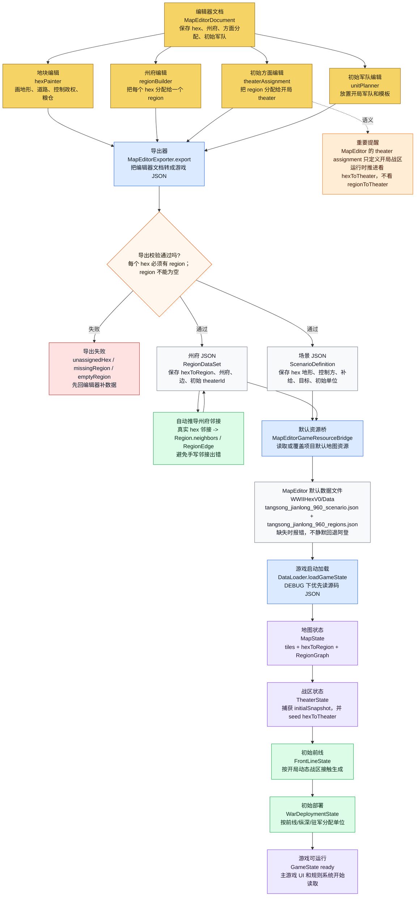

## 6. v1.1 主游戏 macOS 入口

这张图只说明 v1.1 新增的 macOS 主游戏 target。它复用主游戏数据、UI、SpriteKit 棋盘和规则系统；macOS 输入只是平台桥接，不是新的规则入口。

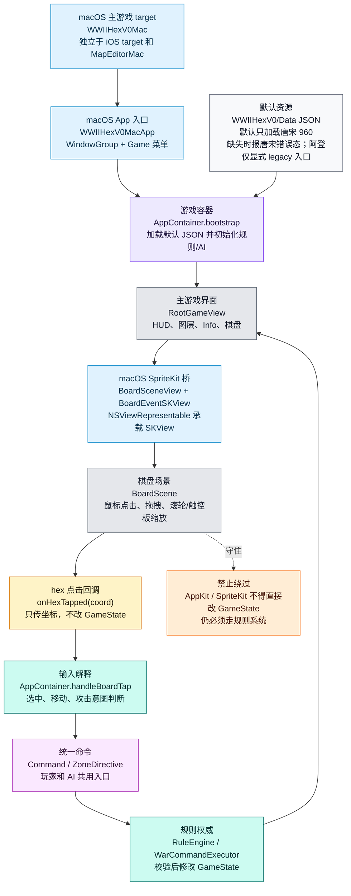

## 7. v1.0 UI / AI / 初版试玩链路

这张图说明 v1.0 分支的收口点：它不新增规则入口，只改善 UI 可读性、AI 回放、轻量性能和试玩记录。

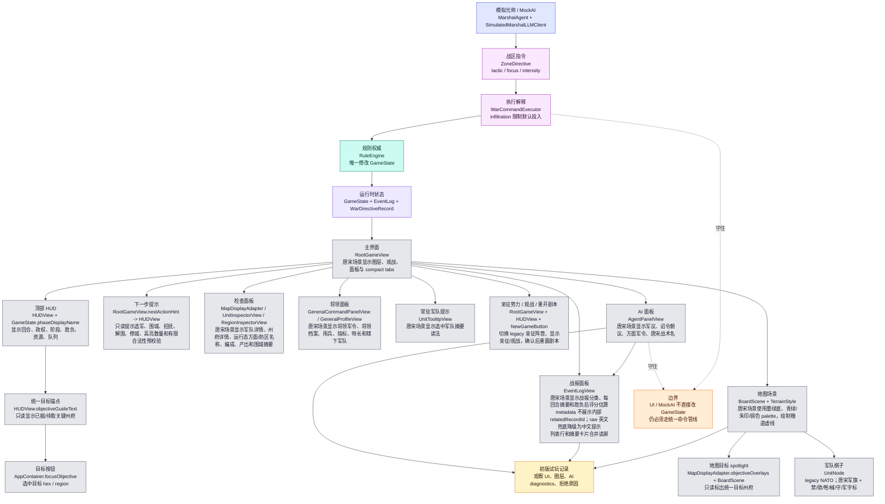

## 8. v0.4 将军与玩家双轨命令

这张图说明 v0.4 分支的新增主线：实体将军从 JSON / region 种子接入 FrontZone；玩家可以微操具体部队，也可以通过将军面板发战区宏观命令。两条路最终仍收口到规则系统。

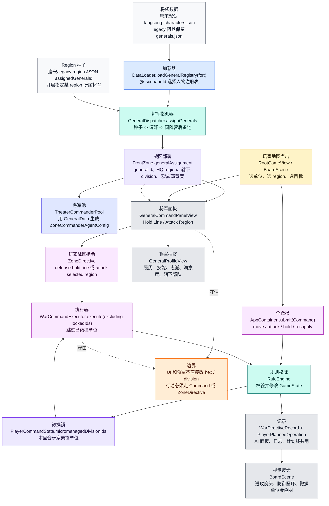

## 9. 云端协作：main 直推与结果包验收

这张图说明当前默认协作制度。它不改变游戏规则，只规定 Agent A/B/C 如何把本地轻量检查、`main` 直推、GitHub Actions 云端重验证和 Agent C 结果包复判串起来。

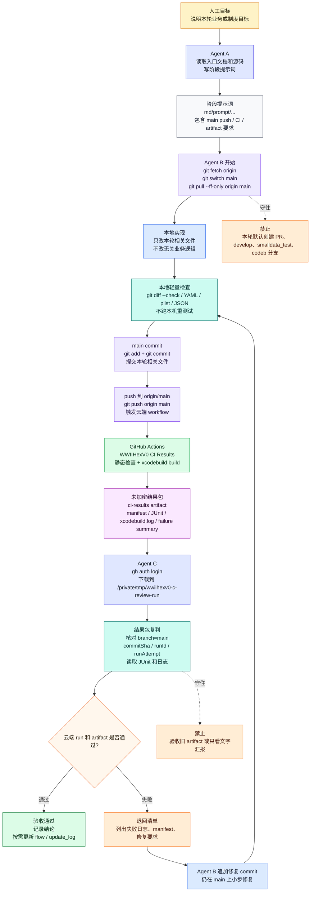
